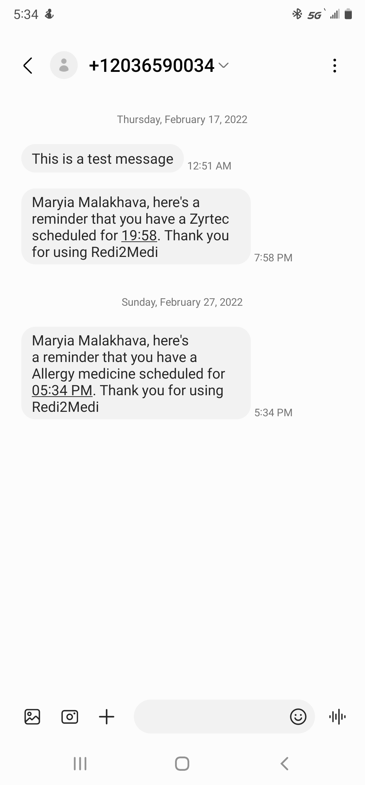
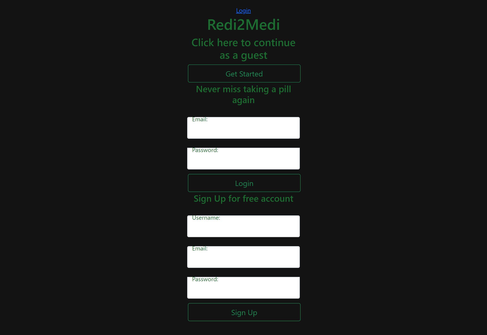

 
   
   # REDI2MEDI
   ## https://github.com/TrevorL0ng
   
   ## Description 
   
   REDI2MEDI is an app, that allows you to create a reminders for taking you medications on time. Our idea was to provide a solution to the problems that many people have with taking their medications on time. REDI2MEI offers a product that delivers improved quality of life for patients along with peace of mind for their loved ones, caregivers, and prescribing physicians. ​
   
   ## Table of Contents  
   * [Installation](#installation)
   * [Issues](#issues)
   * [Contributors](#contibutors)
   * [License](#license)
   * [Contributing](#contributing)
   * [Questions](#questions)
   
   
   ## Installation 
   
   The project was uploaded to GitHub at the following repository: https://github.com/TrevorL0ng/Redi2Medi
   You can access the deployed application with the Heroku link: https://redi4medi.herokuapp.com/

   To install the project follow these steps:

   * Clone the application from GitHub with:
      git clone [clone link from GitHub]

   * From the root folder, install the dependencies with:
      npm install

   * Run the app with:
      node server.js

   ## Issues
   
   We are still working on login logic, however we added guest option, which allows to use app without signing in, or creating account. Currently there is a test api key, that is tied to Trevor's phone number, if you click continue as a guest and use this number +17047967193, you will be able to see app functionality, it will take you to the confirmation page. Unfortunately in order to use any phone number and be able to send real messages we have to pay for the subscription. We were given some free real life messages, but we ran out of them during testing process. Please, see an example of of real life SMS on the screenshot below.

   
   

   ## Contributors

   Maryia Malakhava https://github.com/malakhavam
   Lucas Moraes https://github.com/lucasmo066

   ## License

   MIT
  
   ## Contributing
   
   * Pull requests are welcome.
   * For major changes, please open an issue first to discuss what you would like to change.
   * Please make sure to update tests as appropriate.
   
   ## Questions
   
   If you have questions or you want to share comments, we will be glad to hear from you. Please contact us at malakhava@yahoo.com

   https://github.com/https://github.com/TrevorL0ng/REDI2MEDI
   
   malakhava@yahoo.com
 